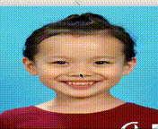

# Image-Morphing
## build
###Linux

```
git clone git@github.com:zhzdeng/Image-Morphing.git
cd Image-Morphing
make
./morphing -s input/1.jpg -d input/2.jpg
```
### MacOS
### Precondition
install [Quartz](https://www.xquartz.org/)
### Install
```
git clone git@github.com:zhzdeng/Image-Morphing.git
cd Image-Morphing
make
./morphing -s input/1.jpg -d input/2.jpg
```

## Example
example

result


## Thanks to
- [delaunay](https://github.com/eloraiby/delaunay)
- [CImg](http://www.cimg.eu/)
- [GenericMakefile](https://github.com/mbcrawfo/GenericMakefile)

